
<h1 align="center">医院病历管理系统</h1>

## 简介
医院病历管理系统：基于Spring Boot，角色分为管理员和用户；功能包括个人中心、病人管理、医生管理、住院信息管理、出院信息管理、病历信息管理、科室管理，旨在简化医院流程和提高信息管理效率。    --计算机毕业设计源码；毕设源码；java毕业设计源码

## 联系方式

<h3 align="center">获取完整代码与数据库文件 + 微信：deepguan QQ: 86050149 QQ群: 783742310</h3>

<h3 align="center">可帮忙远程部署 包运行成功！提供远程部署、修改代码、设计文档指导、代码讲解等服务！</h3>

## 功能介绍（完整见运行截图）
管理员：主要负责系统的全面管理，包括添加、修改和删除病人、医生及科室信息；管理住院和出院信息；执行病历信息的管理操作。管理员可以通过导航栏快速访问个人中心、系统首页、和各个信息管理模块，并能够为用户提供密码修改和个人信息更新功能。此外，系统支持管理员进行用户权限审核和系统设置的调整，确保信息录入的准确性及安全性。界面设计简洁，突出便捷操作和快速响应功能，实现高效的医院病历管理。

医生：医生用户主要使用系统进行病人的信息查询和病历管理动作，通过直接访问病人基本信息、住院历史和出院详情。医生可录入新的病历及查看已有的详细记录，支持上传诊断文件和记录诊疗方案。系统提供医生专属的快速搜索功能，通过病人账号或姓名轻松定位需要的病历，并及时更新治疗方案及备注信息。医生用户界面便捷直观，以医疗专业需求为导向，提高工作效率并有效减少潜在信息管理错误。

病人：病人用户能够通过医院病历管理系统查询个人基本信息以及住院和出院记录。系统支持病人修改他们的基本资料如联系方式或家庭住址，加强医疗信息的正确性和有效性。病人在个人中心可以查看自己的病历记录，包括就诊医生、治疗方案以及住院期间的信息。系统同时提供安全的密码修改功能及查看个人信息变更历史，以保护患者隐私并确保记录的完整与审查。

技术支持：技术支持团队需确保系统的稳定运行与维护，负责服务器的日常管理、数据备份、版本更新及功能优化等技术任务。技术支持通过提供后端系统修复和用户操作指南，帮助解决管理员和医生在使用系统时遇到的问题。同时，关注系统界面美学与用户体验的提升，通过反馈机制搜集使用意见并改进功能模块。技术团队需与其他角色密切协作以保证系统高效、安全以及长效的使用。

## 运行截图
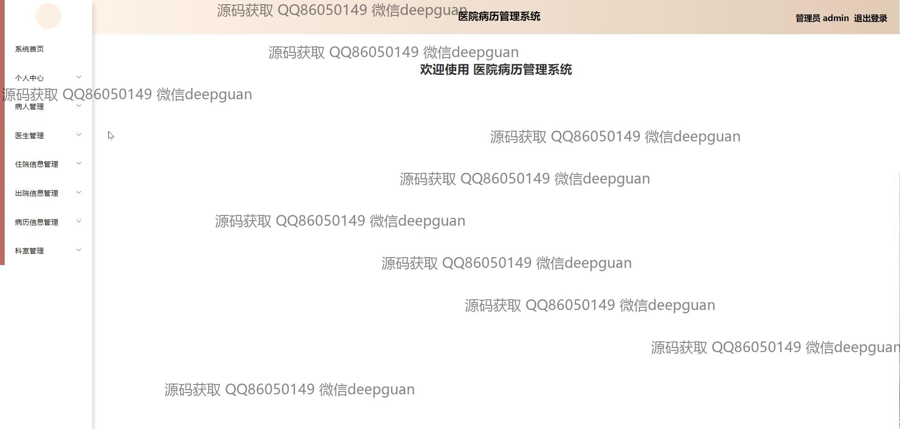
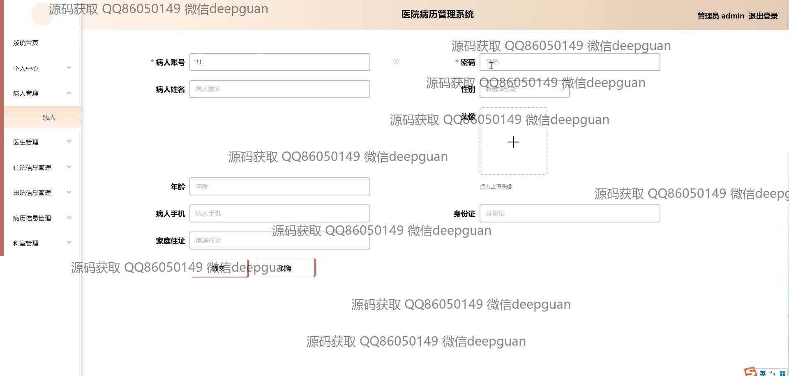
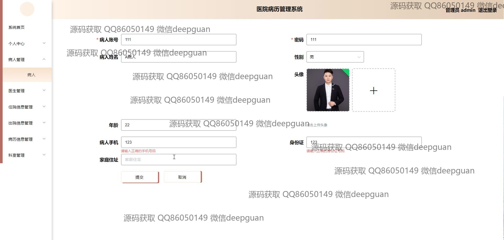
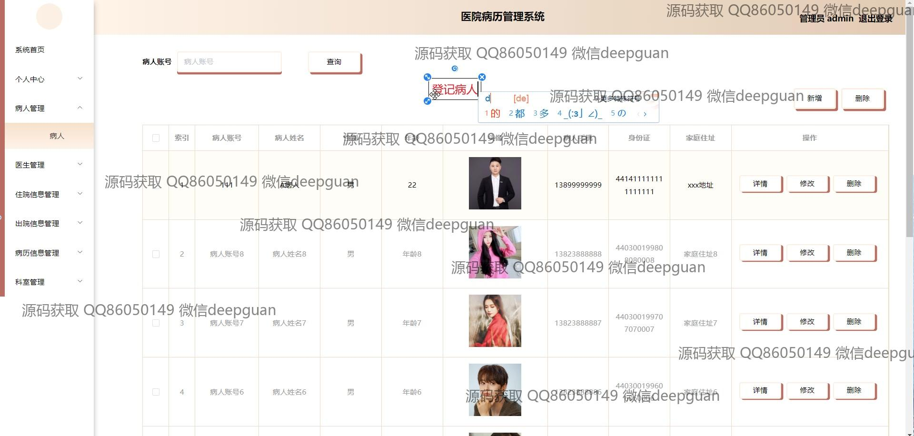
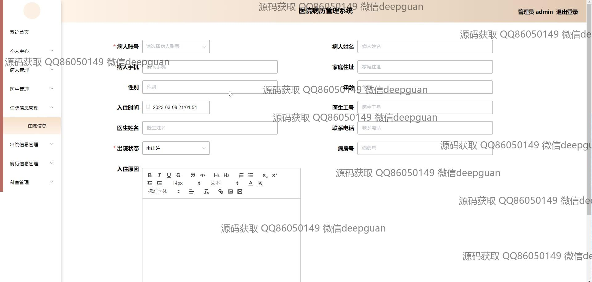
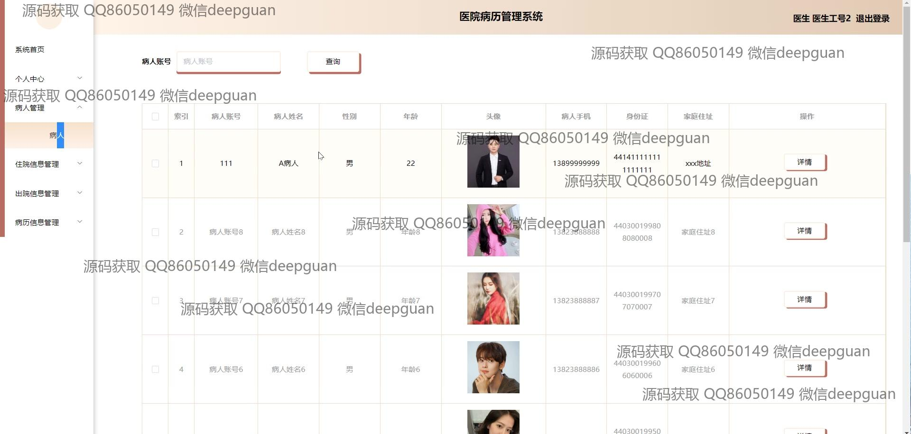
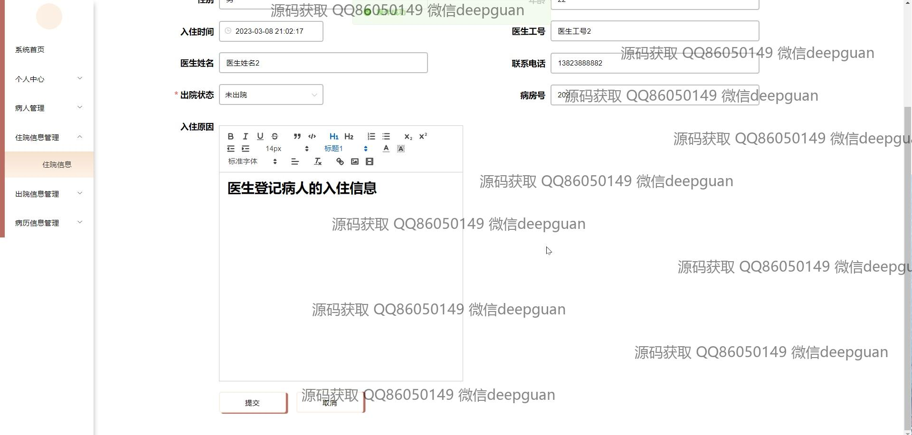
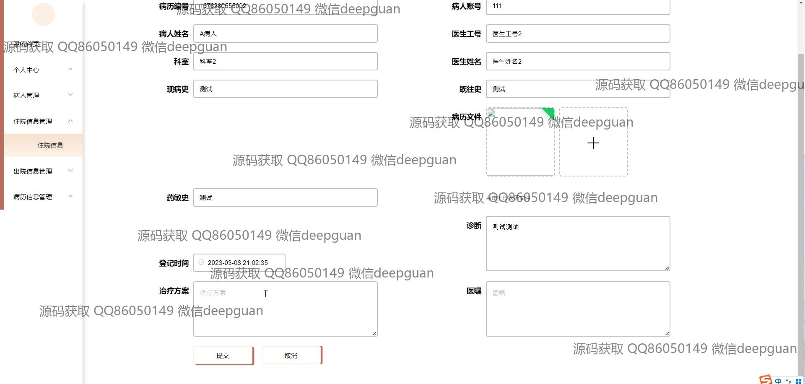
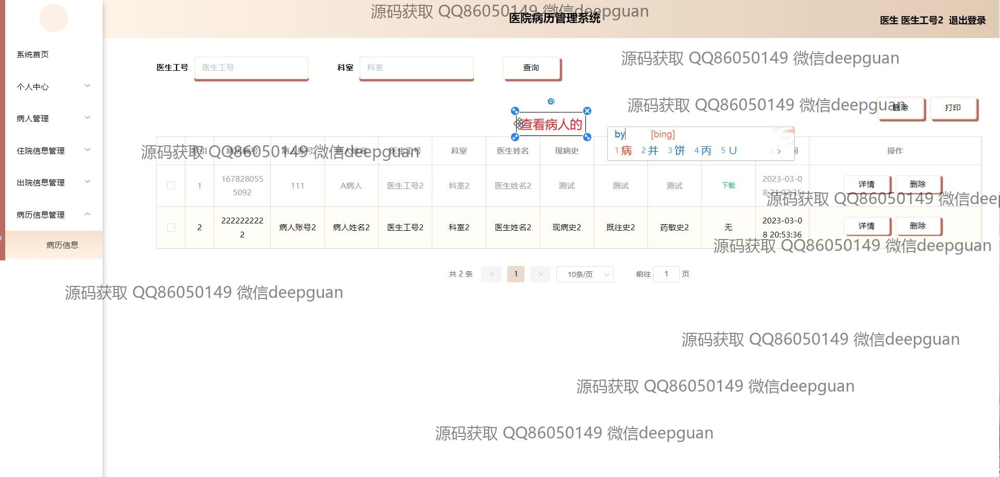
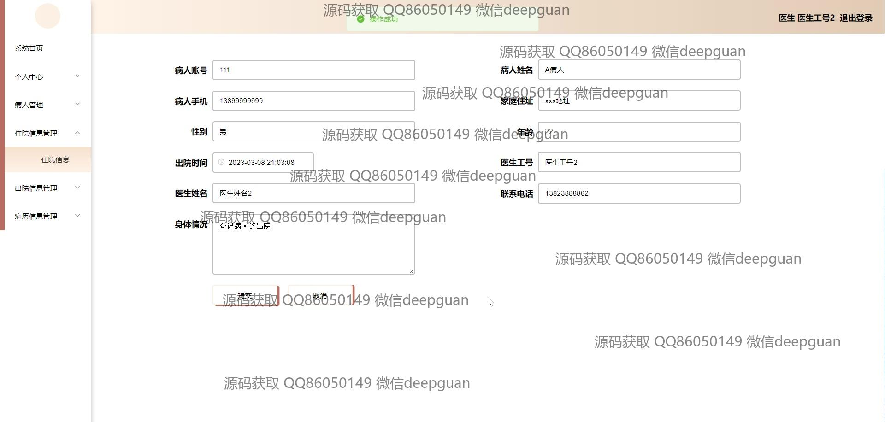
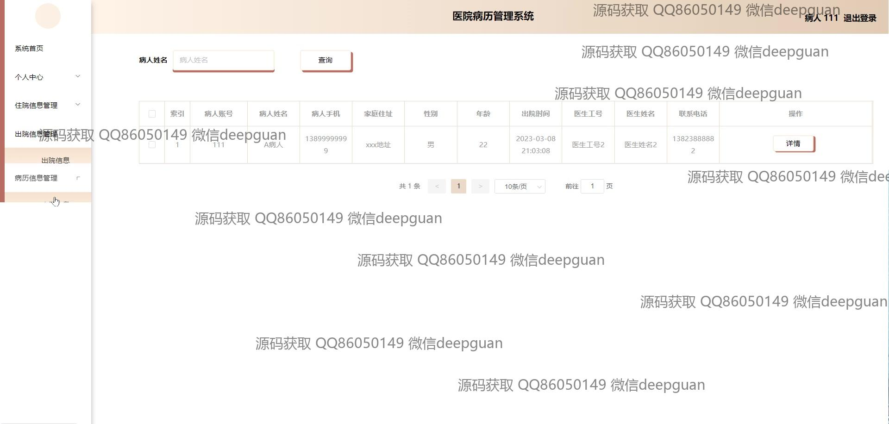
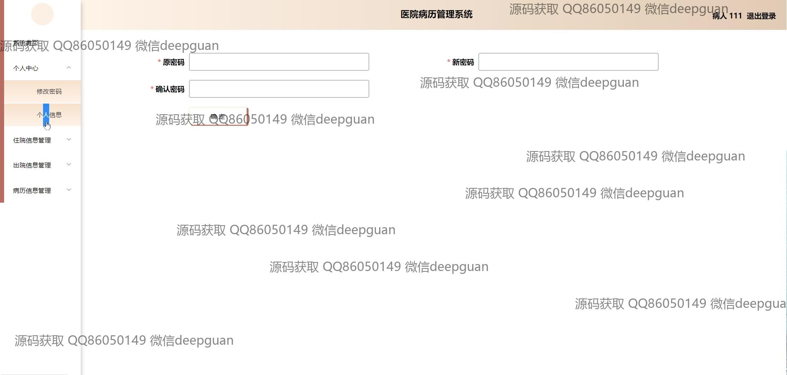
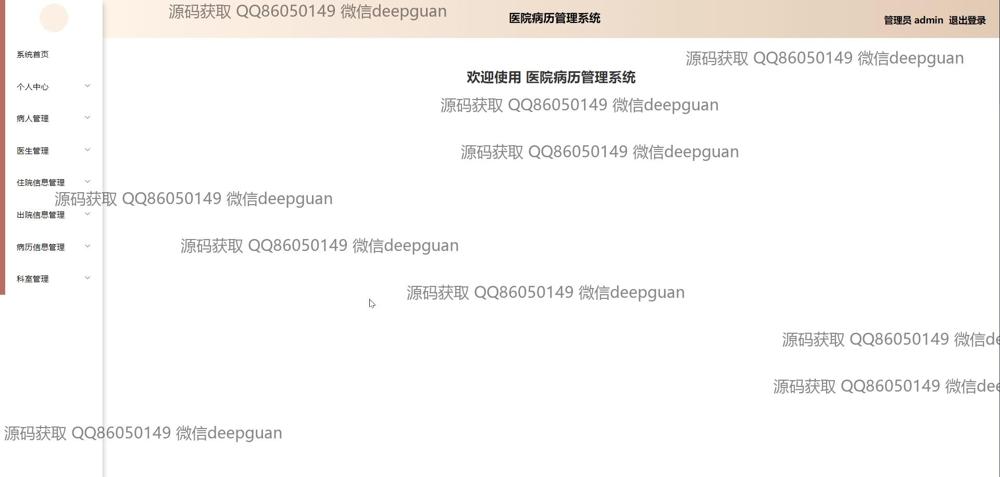

本代码来源于网络,仅供学习参考使用!

